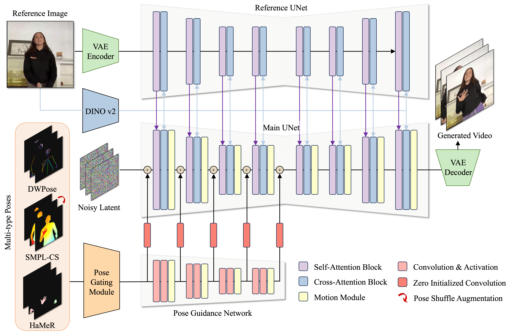

# RealisDance: Equip controllable character animation with realistic hands


This repository is the official implementation of [RealisDance](https://arxiv.org/abs/2409.06202).
RealisDance enhances pose control of existing controllable character animation methods,
achieving robust generation, smooth motion, and realistic hand quality. 
The architecture of RealisDance is shown as follows:



## News
- **2024-09-10**: Now you can try more interesting AI video editing in [XunGuang](https://xunguang.damo-vision.com/) !!!
- **2024-09-09**: You may also be interested in our human part repair method [RealisHuman](https://github.com/Wangbenzhi/RealisHuman).

## Gallery
Here are several **finger dances** generated by RealisDance.

<table class="center">
    <tr>
    <td></td>
    <td></td>
    </tr>
    <tr>
    <td></td>
    <td></td>
    </tr>
    <tr>
    <td></td>
    <td></td>
    </tr>
</table>

## Quick Start

### 1. Setup Repository and Environment

```
git clone https://github.com/theFoxofSky/RealisDance.git
cd RealisDance

pip install -r requirements.txt
pip install -e .
```

### 2. Prepare Pretrained Checkpoints

```
mkdir pretrained_models
cd pretrained_models

# prepare rv-5-1 from https://huggingface.co/SG161222/Realistic_Vision_V5.1_noVAE/tree/main
mkdir RV
cd RV
ln -s $PATH-TO-RV-5-1 rv-5-1
cd ../

# prepare dino v2 from https://huggingface.co/facebook/dinov2-large/tree/main
mkdir DINO
cd DINO
ln -s $PATH-TO-DINOV2 dinov2
cd ../

# prepare motion module from https://github.com/guoyww/AnimateDiff
mkdir MM
cd MM
ln -s $PATH-TO-MM mm_v2.ckpt
cd ../

(Optional)
# prepare sd-vae-ft-mse from https://huggingface.co/stabilityai/sd-vae-ft-mse
# link to a SD dir with a subfolder named 'sd-vae-ft-mse' 
```

### 3. Quick Inference

- Download our trained RealisDance [chekcpoint](https://huggingface.co/theFoxofSky/RealisDance).

- Prepare your reference image (a half-body selfie with a clean background will get better results).

- Inference with demo sequences

```commandline
python inference.py --config configs/stage2_hamer.yaml --smpl __assets__/demo_seq/smpl_1.mp4 \
    --hamer __assets__/demo_seq/hamer_1.mp4 --dwpose __assets__/demo_seq/dwpose_1.pkl \
    --ckpt $PATH-TO-CKPT --ref $PATH-TO-REF-IMG --output $PATH-TO-OUTPUT
```

### 4. Prepare Datasets

The structure of our dataset is highly customized, so please refer to our code to **REWRITE** the dataset part.

Note that the dataset returns a Dict like this:

```python
{
    "data_key": id_of_data,
    "image": target_image_or_video,  # video should be in shape (B, C, F, H, W)
    "pose": target_dwpose_image_or_video,  # video should be in shape (B, C, F, H, W)
    "hamer": target_hamer_image_or_video,  # video should be in shape (B, C, F, H, W)
    "smpl": target_smpl_image_or_video,  # video should be in shape (B, C, F, H, W)
    "ref_image": reference_image, 
    "ref_image_clip": reference_dino_image,
}
```


### 5. Train Your RealisDance

```
# stage1
CUDA_VISIBLE_DEVICES=0,1,2,3,4,5,6,7 torchrun --nnodes=1 --nproc_per_node=8 \
    train.py --config configs/stage1_hamer.yaml 

# stage2
CUDA_VISIBLE_DEVICES=0,1,2,3,4,5,6,7 torchrun --nnodes=1 --nproc_per_node=8 \
    train.py --config configs/stage2_hamer.yaml 
```

### 6. Evaluate Your RealisDance

```
# stage1
CUDA_VISIBLE_DEVICES=0,1,2,3,4,5,6,7 torchrun --nnodes=1 --nproc_per_node=8 \
    evaluate.py --config configs/stage1_hamer.yaml --output $PATH-TO-OUTPUT --ckpt $PATH-TO-CKPT

# stage2
CUDA_VISIBLE_DEVICES=0,1,2,3,4,5,6,7 torchrun --nnodes=1 --nproc_per_node=8 \
    evaluate.py --config configs/stage2_hamer.yaml --output $PATH-TO-OUTPUT --ckpt $PATH-TO-CKPT
```

## Disclaimer
This project is released for academic use.
We disclaim responsibility for user-generated content.

## Contact Us
Jingkai Zhou: [fs.jingkaizhou@gmail.com](mailto:fs.jingkaizhou@gmail.com)


## BibTeX
```
@article{zhou2024realisdance,
  title={RealisDance: Equip controllable character animation with realistic hands},
  author={Zhou, Jingkai and Wang, Benzhi and Chen, Weihua and Bai, Jingqi and Li, Dongyang and Zhang, Aixi and Xu, Hao and Yang, Mingyang and Wang, Fan},
  journal={arXiv preprint arXiv:2409.06202},
  year={2024}
}
```


## Acknowledgements
Codebase built upon [Open-Animate Anyone](https://github.com/guoqincode/Open-AnimateAnyone), [Moore-Animate Anyone](https://github.com/MooreThreads/Moore-AnimateAnyone), and [MusePose](https://github.com/TMElyralab/MusePose).
